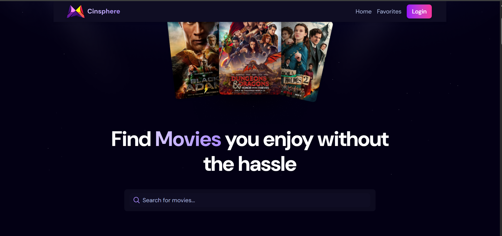
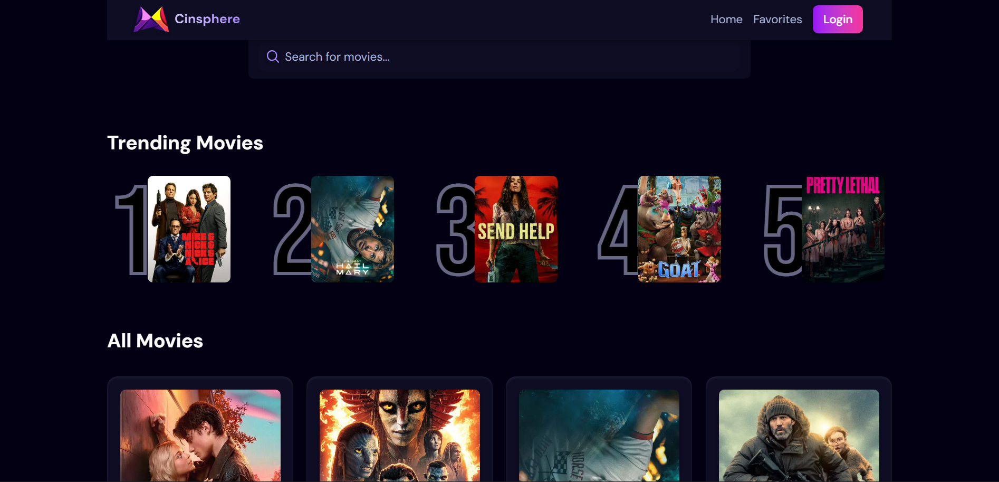
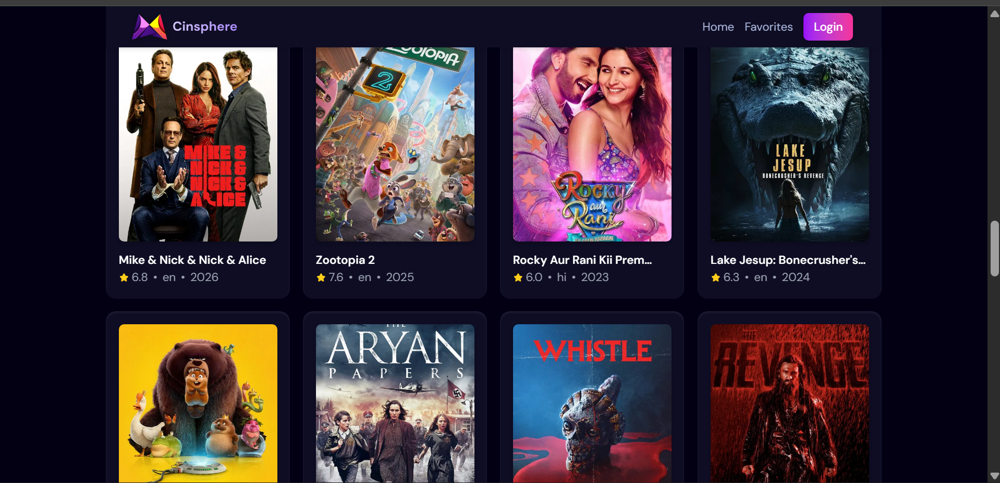
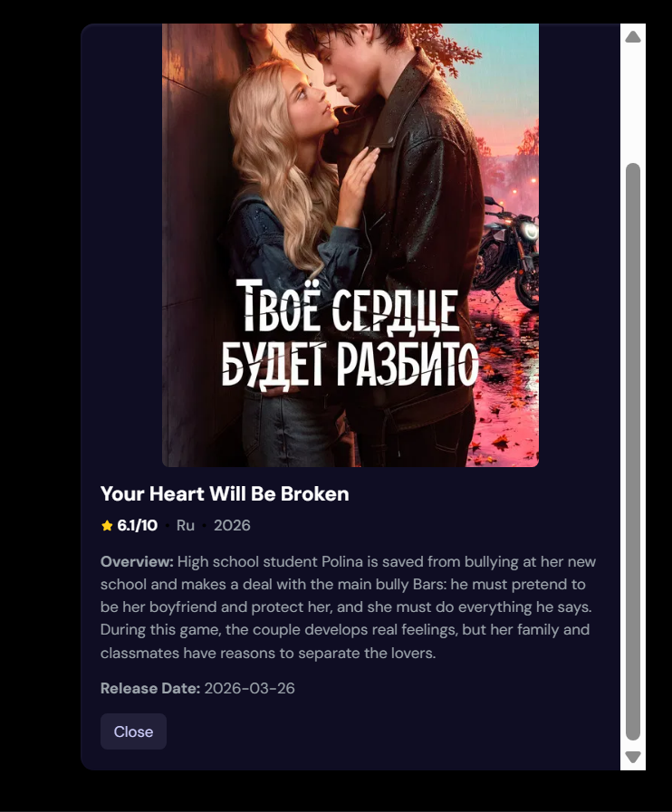
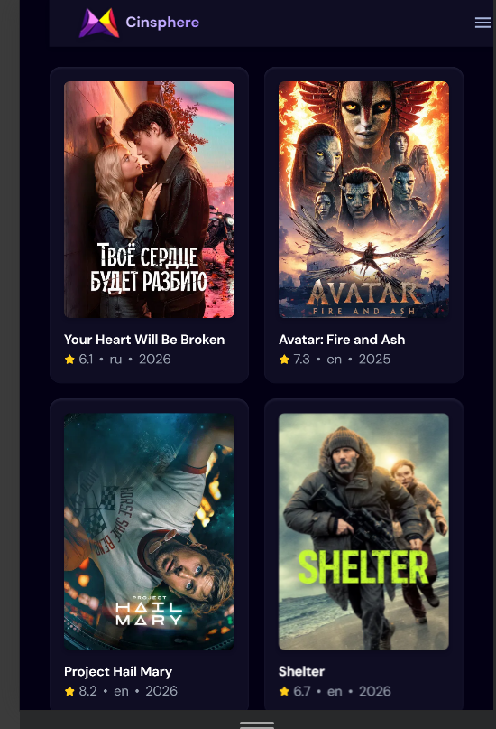

# Cinsphere - Movie Discovery & Favorites

Cinsphere is a React + Vite movie discovery app that pulls data from TMDB and lets signed-in users save favorites. It includes fast search with debouncing, trending highlights, infinite scroll for popular titles, and a clean modal view for movie details.

## What This App Does
- Browse popular movies and trending picks from TMDB.
- Search with debounce and clear controls.
- Infinite scroll powered by `IntersectionObserver`.
- Open a movie details modal from any card.
- Create an account and sign in (JWT stored in `localStorage`).
- Add/remove favorites synced with the backend API.
- Responsive layout with animated navbar and tilt cards.

## Tech Stack
- React 19 + Vite
- Tailwind CSS
- React Router
- Axios
- GSAP
- React Parallax Tilt

## Screenshots
All screenshots live in `public/readmes` and are rendered below (not links).

### Hero


### Trending


### Movie List


### Movie Details


### Mobile View


## Getting Started

### 1) Install
```bash
npm install
```

### 2) Configure TMDB
Create a `.env` file in `movie_app` and add:
```bash
VITE_TMDB_API_KEY=your_tmdb_bearer_token
```
The app uses the TMDB v3 API with a Bearer token.

### 3) Run the App
```bash
npm run dev
```

## Backend Overview (Used by Frontend)
Favorites and auth are handled by the backend API:
- Base URL: `https://cinspherebackend-2.onrender.com/api`
- Auth endpoints: `/user/login`, `/user/signup`
- Favorites endpoints: `/favorites`, `/favorites/add`, `/favorites/remove`

### Backend Stack
- Node.js + Express
- MongoDB + Mongoose
- JWT authentication
- Bcrypt password hashing
- CORS + Cookie Parser
- Passport Google OAuth (available in backend routes)

### Auth Flow
- Backend issues a JWT and sets an HTTP-only cookie.
- Frontend stores the token in `localStorage` for API calls.
- Favorites routes are protected by auth middleware.

## Notes
- The Google OAuth button in the login modal is currently a placeholder.
- If the TMDB API key is missing, the app will show an error.

## Project Structure (Frontend)
```
movie_app/
  public/
    readmes/            # README screenshots
  src/
    components/         # UI building blocks (Navbar, MovieCard, Auth, Search)
    context/            # AuthContext
    pages/              # Favorites page
    api.js              # Backend API helpers
    App.jsx             # Main app logic & routing
```
